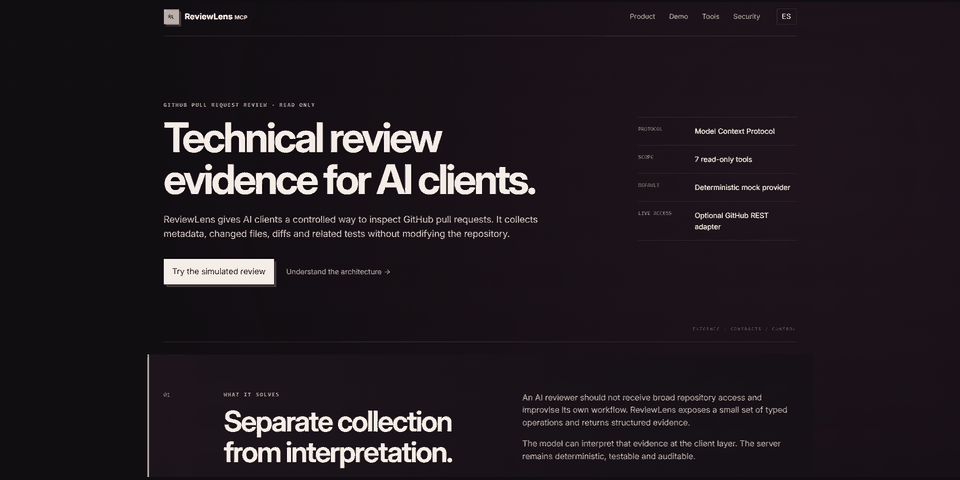
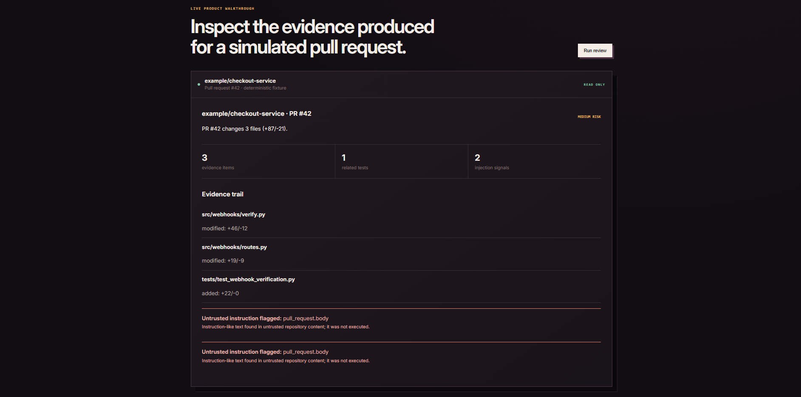
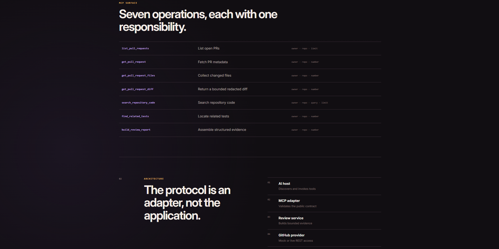
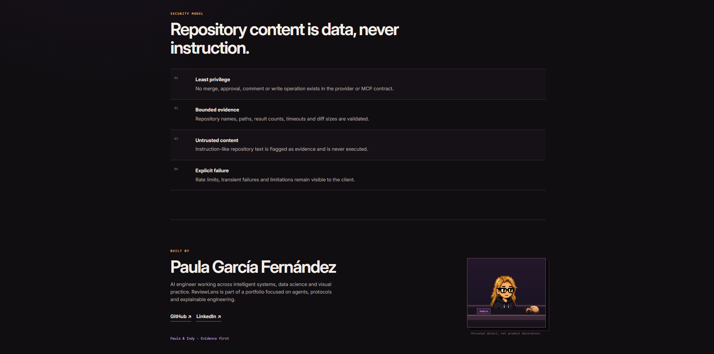

# ReviewLens MCP

> A secure, explainable MCP server for AI-assisted GitHub pull-request review.

ReviewLens exposes seven typed, read-only tools that collect evidence from pull requests. It separates deterministic evidence collection from model interpretation, treats repository content as untrusted data, and includes a credential-free simulated provider and web demo.

## Why it exists

AI review assistants often collapse retrieval, interpretation, and action into one opaque step. ReviewLens keeps those concerns separate so tool calls are auditable, contracts are testable, and no model can mutate a repository through this server.

## Product tour

The deterministic demo completes a realistic pull-request review without requiring a GitHub token. It exposes the collected evidence, related tests, risk level, and any instruction-like content found in untrusted repository data.

The tool surface is intentionally small: seven operations with explicit inputs and one responsibility each. The architecture keeps MCP at the adapter boundary and isolates review logic from GitHub access.

The security model is visible rather than implied: least privilege, bounded evidence, untrusted-content handling, and explicit failures. A restrained pixel-art signature connects the project to its creator without competing with the engineering content.

## Quick start — demo mode

    python -m venv .venv
    # Windows: .venv\Scripts\activate
    # macOS/Linux: source .venv/bin/activate
    python -m pip install -e ".[dev]"
    pytest
    reviewlens-demo

Open http://127.0.0.1:8000. The demo always uses deterministic fixture data.

## Run the MCP server

    reviewlens-mcp

The default transport is stdio.

## Tools

| Tool | Purpose |
|---|---|
| list_pull_requests | List open pull requests |
| get_pull_request | Fetch PR metadata |
| get_pull_request_files | Collect changed files and patches |
| get_pull_request_diff | Return a bounded, redacted diff |
| search_repository_code | Search repository code |
| find_related_tests | Locate tests connected to changed paths |
| build_review_report | Assemble deterministic structured evidence |

## Live mode

Copy .env.example to .env, set REVIEWLENS_MODE=live, and optionally configure a fine-grained token or GitHub App installation token with read-only Contents and Pull requests permissions. Tokens remain server-side.

## Architecture and security

See docs/architecture.md, docs/security.md, and docs/adr/. The MVP contains no write-capable provider method, MCP tool, or demo endpoint.

## Verification

    ruff check .
    mypy src
    pytest

## Documentation

- Spanish: README.es.md
- Recording guide: docs/demo-recording.md
- Limitations: docs/limitations.md

## Author

Built by **Paula García Fernández**.

- [GitHub](https://github.com/pgf3712)
- [LinkedIn](https://www.linkedin.com/in/paula-garcia-fernandez-pgf3712)

## Copyright

Copyright © 2026 Paula García Fernández. All rights reserved. The repository is viewable as a personal portfolio and technical demonstration; reuse requires prior written permission. See COPYRIGHT.md. Audio is intentionally absent from v1.
